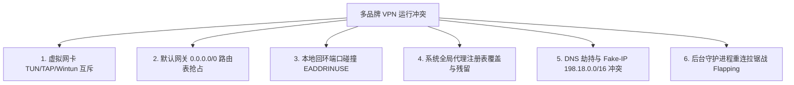

# 跨平台多品牌 VPN / 代理客户端冲突终极剖析与排障全景指南
### 🌐 Multi-Brand VPN & Proxy Conflict Resolution Handbook (Windows / macOS / Android / iOS / Linux)

[](https://github.com/Rouen007)
[](https://github.com/Rouen007/vpn-troubleshooting-handbook)
[](LICENSE)

---

## 📌 概述 (Executive Summary)

在个人电脑、手机、平板或软路由上，当用户同时安装或轮换使用多个不同品牌的 VPN / 代理客户端（如 **Clash Verge Rev, Clash Nyanpasu, Clash for Windows, Mihomo/Clash Meta, v2rayN/v2rayNG, Sing-box, Karing, Shadowrocket, Quantumult X, Surfshark, ExpressVPN, WireGuard, OpenVPN, EasyConnect, GlobalProtect** 等）时，经常会遇到以下经典故障：

1. **明明连上了 VPN，但所有网页和 App 均无法联网（DNS 瘫痪或丢包 100%）**；
2. **开启客户端 B 后，客户端 A 瞬间被踢下线或静默断流**；
3. **关闭或卸载某款 VPN 后，整台电脑/手机彻底断网（必须重置网络）**；
4. **客户端启动失败，控制台狂报 `bind: address already in use` (端口占用)**；
5. **网速剧烈波动、持续转菊花、CPU 占用飙升至 100%（后台拉锯战 Flapping）**。

本项目深度剖析多品牌 VPN 冲突的 **六大底层技术根源**，并提供 **四大标准共存架构** 与 **跨平台一键诊断修复脚本**。

---

## 📖 目录
- [一、多品牌 VPN 冲突的六大底层技术根源](#一多品牌-vpn-冲突的六大底层技术根源)
  - [1. 虚拟网卡驱动与系统接口互斥 (TUN / TAP / Wintun / VpnService)](#1-虚拟网卡驱动与系统接口互斥-tun--tap--wintun--vpnservice)
  - [2. 路由表抢占与 Metric 跳数竞争 (0.0.0.0/0 默认网关互斥)](#2-路由表抢占与-metric-跳数竞争-00000-默认网关互斥)
  - [3. 本地回环端口硬碰撞 (bind: address already in use)](#3-本地回环端口硬碰撞-bind-address-already-in-use)
  - [4. 系统全局代理设置 (System Proxy) 覆盖与残留](#4-系统全局代理设置-system-proxy-覆盖与残留)
  - [5. DNS 污染、Fake-IP 地址池与劫持冲突](#5-dns-污染fake-ip-地址池与劫持冲突)
  - [6. 后台守护进程重连拉锯战 (Flapping Loop)](#6-后台守护进程重连拉锯战-flapping-loop)
- [二、多品牌 VPN 共存与冲突解决的四大架构方案](#二多品牌-vpn-共存与冲突解决的四大架构方案)
  - [方案 1：统一底层内核（多订阅合并，彻底杜绝多开）](#方案-1统一底层内核多订阅合并彻底杜绝多开-推荐)
  - [方案 2：分层分流（TUN 模式与本地 Socks5/HTTP 代理分离）](#方案-2分层分流tun-模式与本地-socks5http-代理分离)
  - [方案 3：链式代理 / 前置代理 (Upstream Relay)](#方案-3链式代理--前置代理-upstream-relay)
  - [方案 4：跨平台一键冲突清理与端口释放工具](#方案-4跨平台一键冲突清理与端口释放工具)
- [三、跨平台一键排障与清理命令速查 (Cheat Sheet)](#三跨平台一键排障与清理命令速查-cheat-sheet)
- [四、排坑军规与最佳实践 (Golden Rules)](#四排坑军规与最佳实践-golden-rules)

---

## 一、多品牌 VPN 冲突的六大底层技术根源



### 1. 虚拟网卡驱动与系统接口互斥 (TUN / TAP / Wintun / VpnService)

| 操作系统 | 底层虚拟网卡实现 | 互斥机理 |
| :--- | :--- | :--- |
| **Android** | `android.net.VpnService` | **单例排他**：系统全局严格只允许 **1 个活动 TUN 接口 (`tun0`)**。当第二款 VPN 建立连接时，操作系统会自动强制注销并销毁前一个 VPN 的 Tunnel，无任何缓冲。 |
| **iOS / iPadOS** | `NetworkExtension (PacketTunnel)` | **单例排他**：iOS 系统级仅允许一个活动 `NEPacketTunnelProvider`。开启新 VPN 会直接踢断旧 VPN。 |
| **Windows** | `Wintun` / `TAP-Windows Adapter` | **驱动/设备名冲突**：若多个客户端都尝试创建同名 adapter（如 `wintun`），或者抢占同一个虚拟 IP 段（如 `198.18.0.1/16`），会导致驱动抛错或 ARP 表混乱。 |
| **macOS** | `utun` 设备 (`/dev/utun*`) | 多个 TUN 实例竞争系统默认路由，导致 packet filter (pf) 规则相互覆盖。 |

---

### 2. 路由表抢占与 Metric 跳数竞争 (0.0.0.0/0 默认网关互斥)

当开启 **TUN 模式 (全局虚拟网卡接管)** 时，客户端会向系统路由表注入一条默认路由：
```text
0.0.0.0/0 -> 网关指向该 VPN 的虚拟网卡 IP (例如 198.18.0.1)
```
* **冲突表现**：
  1. **客户端 A** 写入了路由 `0.0.0.0/0 dev tun0 metric 1`；
  2. **客户端 B** 启动后，强行覆盖为 `0.0.0.0/0 dev tun1 metric 1`；
  3. 当客户端 B 退出时，删除了自己的路由，但**不会恢复客户端 A 的旧路由**；
  4. 最终导致系统丢失默认网关，**所有物理外网流量彻底黑洞化 (Blackhole)**。

---

### 3. 本地回环端口硬碰撞 (`bind: address already in use`)

不同品牌的代理客户端底层大多基于 **Mihomo (Clash Meta) / Xray-core / Sing-box** 编译而来，默认配置通常采用相同的固定端口：

```text
❌ 7890 : 默认 Mixed (HTTP+SOCKS5) 代理端口
❌ 7893 / 7897 : Clash Verge / Mihomo 常用端口
❌ 10808 / 10809 : v2rayN / v2rayNG 默认 HTTP/SOCKS 端口
❌ 9090 / 9097 : RESTful Web 控制面板 API 端口
❌ 53 / 1053 : 内置 DNS 监听端口
```
当客户端 A 在后台驻留（或僵尸进程未退出）时，客户端 B 启动尝试 `bind()` 相同端口，会直接抛出 **`EADDRINUSE (Address already in use)`** 致命错误，导致代理内核直接崩溃退出。

---

### 4. 系统全局代理设置 (System Proxy) 覆盖与残留

在 Windows / macOS 上，不开启 TUN 模式的客户端通常会修改系统的 Web 代理设置：
* **Windows 注册表**：`HKCU\Software\Microsoft\Windows\CurrentVersion\Internet Settings` 里的 `ProxyEnable` 与 `ProxyServer`；
* **macOS 系统配置**：`networksetup -setwebproxy`。

**典型翻车场景**：
1. 客户端 A 将系统代理设置为 `127.0.0.1:7890`；
2. 用户退出客户端 A，打开客户端 B（监听 `127.0.0.1:10808`）；
3. 客户端 B 未能成功刷新系统代理注册表；
4. 浏览器的所有流量依然被发往已关闭的 `7890` 端口，页面提示 **`ERR_PROXY_CONNECTION_FAILED`**。

---

### 5. DNS 污染、Fake-IP 地址池与劫持冲突

* **Fake-IP 冲突**：Clash / Sing-box 默认分配 `198.18.0.0/15` 或 `198.18.0.0/16` 作为虚拟 Fake-IP。若两个工具同时运行并维护各自独立的 Fake-IP 映射表，App 拿到的 Fake-IP 将无法在另一个内核的映射表中找到真实域名，导致 **所有 TCP/UDP 连接超时**。
* **本地 DNS 53 端口争抢**：若两款软件都试图在本地 `127.0.0.1:53` 启动抗污染 DNS 服务器，后启动者必将崩溃。

---

### 6. 后台守护进程重连拉锯战 (Flapping Loop)

许多客户端具备“断线自动重连”或“守护看门狗 (Watchdog)”功能：
1. App A 被 App B 踢掉 TUN 连接后，App A 的后台守护线程检测到断网，立刻尝试重新建立 VPN；
2. App A 抢回 VPN 权限，将 App B 踢下线；
3. App B 检测到断线，再次发起抢占……
4. **系统陷入每秒数次的剧烈断连-重连死循环 (Flapping)**，导致系统卡死、发热激增、电量秒空。

---

## 二、多品牌 VPN 共存与冲突解决的四大架构方案

```mermaid
flowchart TD
    subgraph Solution1 [方案 1: 统一核心, 杜绝多开 (推荐)]
        Core[统一单一内核: Mihomo / Sing-box Core]
        Sub1[机场 A 订阅] --> Core
        Sub2[机场 B 订阅] --> Core
        Core -->|单 TUN / 单端口| Out[稳定分流出口]
    end

    subgraph Solution2 [方案 2: 链式代理 / 前置代理 (Cascade Proxy)]
        ClientA[客户端 A: 公司内网 VPN / 专用协议]
        ClientB[客户端 B: Clash / Mihomo 节点]
        ClientA -->|SOCKS5 本地转发| ClientB
        ClientB --> Internet[公共互联网]
    end
```

### 方案 1：统一底层内核（多订阅合并，彻底杜绝多开）—— **推荐**
* **做法**：选用支持多协议的聚合型客户端（如 **Clash Verge Rev、Sing-box、Karing、Shadowrocket**）；
* 将不同品牌 / 机场的订阅链接全部导入到**同一个客户端**中；
* 通过分流规则让不同域名或国家分别走不同的订阅节点。

### 方案 2：分层分流（TUN 模式与本地 Socks5/HTTP 代理分离）
如果你必须同时使用 **“公司内部加密 VPN（如 EasyConnect / GlobalProtect / WireGuard）”** 和 **“科学上网代理”**：
1. **公司 VPN 走专用接口**：让公司 VPN 仅负责内网 IP 段（如 `10.0.0.0/8`, `172.16.0.0/12`），**严禁开启“接管所有默认路由 (0.0.0.0/0)”**；
2. **科学上网客户端关闭 TUN 模式**：仅开启本地 HTTP/SOCKS5 代理端口（`127.0.0.1:7890`）；
3. **通过浏览器扩展分流**：使用 `SwitchyOmega` 或 `ZeroOmega`，将特定境外网址代理到 `127.0.0.1:7890`，内网网址走直接连接。

### 方案 3：链式代理 / 前置代理 (Upstream Relay)
当需要在客户端 A 的外层套上客户端 B 的加密隧道时：
* 在客户端 A 中设置 **External Proxy / Upstream Proxy (上游前置代理)** 为 `127.0.0.1:<客户端B端口>`；
* 流量路径：`应用程序 -> 客户端 A -> 客户端 B -> 目标网站`。

### 方案 4：跨平台一键冲突清理与端口释放工具
本项目在 `tools/` 目录下提供了适用于 Windows、macOS 和 Android 的自动化清理脚本。

---

## 三、跨平台一键排障与清理命令速查 (Cheat Sheet)

### 1. Windows 平台：一键释放占用端口与重置系统代理

```powershell
# 1. 查询哪个 PID 占用了 7890/7897/10808 端口
netstat -ano | findstr ":7890"

# 2. 强制结束冲突的代理进程
taskkill /F /IM "clash.exe" 2>$null
taskkill /F /IM "mihomo.exe" 2>$null
taskkill /F /IM "v2ray.exe" 2>$null
taskkill /F /IM "xray.exe" 2>$null

# 3. 一键重置 Windows 系统代理注册表（解决关掉 VPN 后无法上网）
Set-ItemProperty -Path 'HKCU:\Software\Microsoft\Windows\CurrentVersion\Internet Settings' -Name ProxyEnable -Value 0
Set-ItemProperty -Path 'HKCU:\Software\Microsoft\Windows\CurrentVersion\Internet Settings' -Name ProxyServer -Value ""
```

---

### 2. macOS 平台：一键恢复网络与清理代理

```bash
# 1. 杀死冲突内核进程
pkill -9 -f "mihomo"
pkill -9 -f "clash"
pkill -9 -f "v2ray"

# 2. 关闭 Wi-Fi 接口的 HTTP / HTTPS / SOCKS 代理
networksetup -setwebproxystate "Wi-Fi" off
networksetup -setsecurewebproxystate "Wi-Fi" off
networksetup -setsocksfirewallproxystate "Wi-Fi" off

# 3. 刷新 DNS 缓存
sudo dscacheutil -flushcache; sudo killall -HUP mDNSResponder
```

---

### 3. Android：一键停止冲突客户端与重置代理

```bash
# 1. 强制停止各大冲突 VPN 客户端
adb shell am force-stop io.github.clashparticipant.flclash
adb shell am force-stop com.karing
adb shell am force-stop com.github.kr328.clash
adb shell am force-stop com.v2ray.ang

# 2. 清除残留的全局系统代理
adb shell settings delete global http_proxy
```

---

## 四、排坑军规与最佳实践 (Golden Rules)

1. **一机一核**：一台设备上任何时刻**只允许一个接管全局 TUN 网卡的程序处于激活状态**。
2. **退出前先断开**：在切换或关闭 VPN 软件时，先在软件内点击 **“停止/断开连接”** 再关闭窗口，避免系统代理注册表残留。
3. **固定不同端口**：若必须多款共存备用，手动在各客户端设置中错开端口（例如 A 设 `7890`，B 设 `7891`，C 设 `10808`）。
4. **优先规则分流**：善用多订阅聚合功能，用单一客户端的管理面板统筹所有网络出口。

---

## 📄 License
MIT License. Created by [Rouen007](https://github.com/Rouen007).
