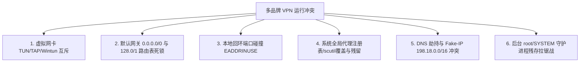
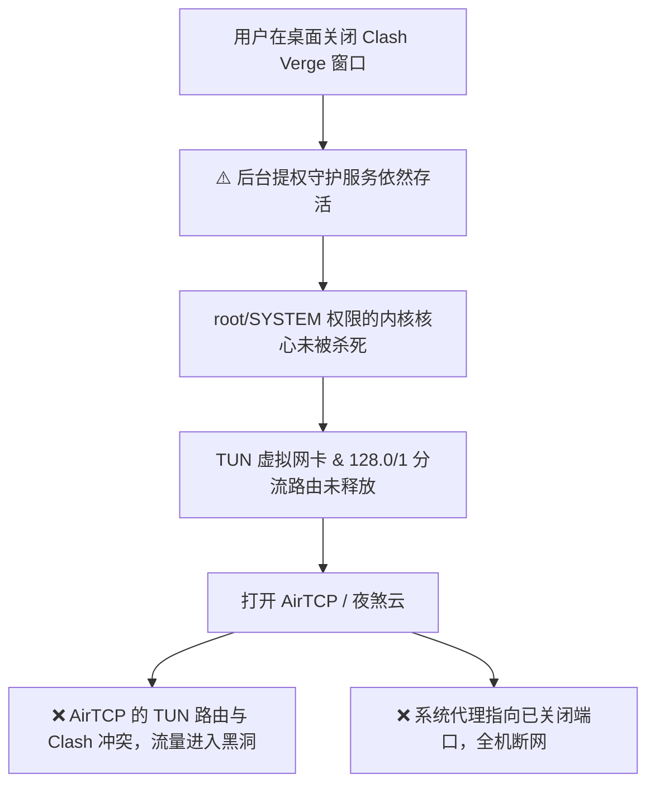

# 跨平台多品牌 VPN / 代理客户端冲突终极剖析与排障全景指南
### 🌐 Multi-Brand VPN & Proxy Conflict Resolution Handbook (Windows / macOS / Android / iOS / Linux)

[](https://github.com/Rouen007)
[](https://github.com/Rouen007/vpn-troubleshooting-handbook)
[-brightgreen)](https://github.com/Rouen007/vpn-troubleshooting-handbook/tree/main/tools)
[](LICENSE)

---

## 📌 概述 (Executive Summary)

在个人电脑、手机、平板或软路由上，当用户同时安装或轮换使用多个不同品牌的 VPN / 代理客户端（如 **Clash Verge Rev, Clash Nyanpasu, Clash for Windows, Mihomo/Clash Meta, AirTCP, 夜煞云, Flybird (飞鸟), v2rayN/v2rayNG, Sing-box, Karing, Shadowrocket, Quantumult X, Surge, Tailscale, WireGuard, OpenVPN, EasyConnect, GlobalProtect** 等）时，经常会遇到以下经典故障：

1. **明明连上了 VPN，但所有网页和 App 均无法联网（DNS 瘫痪、Fake-IP 映射失效或丢包 100%）**；
2. **开启客户端 B 后，客户端 A 瞬间被踢下线或静默断流**；
3. **关闭了 Clash/夜煞云 等软件后，再打开 AirTCP/Flybird 无法使用，整机断网**；
4. **客户端启动失败，控制台狂报 `bind: address already in use` (7890/7897/10808 等端口硬碰撞)**；
5. **内核以 root / SYSTEM 守护服务驻留，关闭 GUI 窗口后依然死锁系统路由表与 DNS**；
6. **网速剧烈波动、持续转菊花、CPU 占用飙升至 100%（后台拉锯战 Flapping）**。

本项目深度剖析多品牌 VPN 冲突在 **Windows 与 macOS 底层的异曲同工之处**，并开源提供 **跨平台 VPN Doctor 桌面一键体检急救工具**。

---

## 🚀 跨平台一键排障神器：VPN Doctor (Windows & macOS)

### 🍏 macOS 端（支持双击原生 App & 终端彩色看板）
```text
======================================================================
     🛠️  VPN Doctor - macOS 多 VPN / 机场软件冲突体检修复工具         
======================================================================
[ 📊 系统实时网络状态看板 ]
  • 系统代理: 🟢 直连模式 (无代理拦截)
  • 代理进程: 🔴 6 个内核在同时运行 (存在冲突争抢风险！)
  • Wi-Fi DNS: 🔵 自定义 (223.5.5.5)
----------------------------------------------------------------------
请选择您需要执行的操作:
  1) 🔍 一键全面体检      (深度扫描网卡代理、DNS死锁、死锁路由、端口争抢)
  2) ⚡ 一键换梯清场 / 急救 [核心推荐] (清掉旧内核、清空代理/DNS/路由、秒恢复纯净)
  3) 🌐 重置系统代理      (仅关闭所有网卡的 HTTP/HTTPS/SOCKS/PAC 代理)
  4) 📡 修复 & 切换 DNS   (重置为 DHCP 或切换阿里/腾讯/Google DNS)
  5) 🚫 强杀所有代理进程  (清理后台冲突的 Clash/AirTCP/夜煞云/Flybird 等)
  6) 📶 网络连通性测试    (测试国内/国际站点响应速度与状态)
  7) 🔄 Wi-Fi 网卡软重启   (解决底层网络栈/DHCP卡死，自动开关Wi-Fi)
  0) 退出工具
```
* **一键安装到桌面**：
  ```bash
  curl -fsSL https://raw.githubusercontent.com/Rouen007/vpn-troubleshooting-handbook/main/tools/install_macos_desktop.sh | bash
  ```

---

### 🪟 Windows 端（PowerShell 全能急救脚本 & 双击批处理）
* **运行方式**：直接右键以管理员身份运行 **[`tools/windows_vpn_doctor.bat`](tools/windows_vpn_doctor.bat)** 或在 PowerShell 中执行：
  ```powershell
  # 终端一键急救清场
  powershell -ExecutionPolicy Bypass -File .\tools\windows_clean_proxy.ps1
  ```

---

## 📖 目录
- [一、Windows 与 macOS 代理底层机制深度对比 (Architecture Mapping)](#一windows-与-macos-代理底层机制深度对比-architecture-mapping)
- [二、多品牌 VPN 冲突的底层技术根源](#二多品牌-vpn-冲突的底层技术根源)
  - [1. 虚拟网卡驱动与系统接口互斥 (TUN / TAP / Wintun / VpnService)](#1-虚拟网卡驱动与系统接口互斥-tun--tap--wintun--vpnservice)
  - [2. 路由表抢占与 Metric 跳数竞争 (0.0.0.0/0 默认网关互斥)](#2-路由表抢占与-metric-跳数竞争-00000-默认网关互斥)
  - [3. 本地回环端口硬碰撞 (bind: address already in use)](#3-本地回环端口硬碰撞-bind-address-already-in-use)
  - [4. 系统全局代理设置 (System Proxy) 覆盖与残留](#4-系统全局代理设置-system-proxy-覆盖与残留)
  - [5. DNS 污染、Fake-IP 地址池与劫持冲突](#5-dns-污染fake-ip-地址池与劫持冲突)
  - [6. 后台守护进程重连拉锯战 (Flapping Loop)](#6-后台守护进程重连拉锯战-flapping-loop)
- [三、典型实机冲突案例深度剖析 (Case Studies)](#三典型实机冲突案例深度剖析-case-studies)
  - [案例：Clash Verge Rev ⇄ AirTCP / 夜煞云 切换断网](#案例clash-verge-rev--airtcp--夜煞云-切换断网)
- [四、多品牌 VPN 共存与冲突解决的四大架构方案](#四多品牌-vpn-共存与冲突解决的四大架构方案)
- [五、跨平台一键排障与清理命令速查 (Cheat Sheet)](#五跨平台一键排障与清理命令速查-cheat-sheet)
- [六、排坑军规与最佳实践 (Golden Rules)](#六排坑军规与最佳实践-golden-rules)

---

## 一、Windows 与 macOS 代理底层机制深度对比 (Architecture Mapping)

Windows 与 macOS 在实现 VPN 与代理劫持时，**核心逻辑高度一致，但在操作系统 API 与底层架构上存在一一对应关系**：

| 技术维度 | Windows 操作系统底层 | macOS 操作系统底层 | 典型冲突现象 (两端通病) |
| :--- | :--- | :--- | :--- |
| **系统代理配置** | `HKCU\...\Internet Settings`<br>`ProxyEnable` & `ProxyServer`<br>`WinINet / WinHTTP` | `SystemConfiguration.framework`<br>`scutil --proxy`<br>`networksetup -setwebproxy` | 软件退出后系统代理指向死端口（`127.0.0.1:7897`），浏览器提示代理无法连接。 |
| **虚拟 TUN 网卡** | `Wintun.dll` / `TAP-Windows Adapter`<br>NDIS Miniport 虚拟网卡驱动 | `/dev/utun*` 设备<br>`NetworkExtension` Framework | 多个软件同时建立 TUN 接口，网卡驱动报错或 ARP 错乱。 |
| **分流路由表劫持** | `0.0.0.0 mask 128.0.0.0`<br>`128.0.0.0 mask 128.0.0.0`<br>`route add / Set-NetRoute` | `0.0.0.0/1 -> utunX`<br>`128.0.0.0/1 -> utunX`<br>`route add -interface utunX` | 软件异常退出后，分流路由残留指向已销毁的虚拟网卡，**所有流量进入黑洞彻底断网**。 |
| **DNS 解析与缓存** | `Dnscache` 服务<br>`Clear-DnsClientCache`<br>`ipconfig /flushdns` | `mDNSResponder` 守护进程<br>`dscacheutil -flushcache`<br>`killall -HUP mDNSResponder` | 残留 Fake-IP (`198.18.x.x`) 映射或死锁 `127.0.0.1` 本地 DNS，全网域名解析失败。 |
| **提权后台守护进程** | **Windows 服务 (Services.msc)**<br>`ClashVergeService` / `NT AUTHORITY\SYSTEM` | **macOS 守护服务 (launchd)**<br>`/Library/PrivilegedHelperTools`<br>`clash-verge-service` (root) | **关闭 GUI 窗口不等于杀死内核**！以 SYSTEM/root 运行的内核继续霸占 TUN 和端口。 |
| **端口监听排查** | `netstat -ano \| findstr :7890`<br>`taskkill /F /PID <pid>` | `lsof -nP -iTCP:7890 -sTCP:LISTEN`<br>`sudo kill -9 <pid>` | 端口被僵尸进程霸占，报 `bind: address already in use` 启动失败。 |

---

## 二、多品牌 VPN 冲突的底层技术根源



### 1. 虚拟网卡驱动与系统接口互斥 (TUN / TAP / Wintun / VpnService)

| 操作系统 | 底层虚拟网卡实现 | 互斥机理 |
| :--- | :--- | :--- |
| **Android** | `android.net.VpnService` | **单例排他**：系统全局严格只允许 **1 个活动 TUN 接口 (`tun0`)**。开启第二款 VPN 时，系统会强制注销前一个 VPN。 |
| **iOS / iPadOS** | `NetworkExtension (PacketTunnel)` | **单例排他**：系统级仅允许一个活动 `NEPacketTunnelProvider`。开启新 VPN 会直接踢断旧 VPN。 |
| **Windows** | `Wintun` / `TAP-Windows Adapter` | **驱动/设备名冲突**：若多个客户端尝试创建同名 adapter（如 `wintun`），或抢占同一个虚拟 IP 段（如 `198.18.0.1/16`），会导致驱动抛错或 ARP 表混乱。 |
| **macOS** | `utun` 设备 (`/dev/utun*`) | 多个 TUN 实例竞争系统默认路由，导致 packet filter (pf) 规则相互覆盖。 |

---

### 2. 路由表抢占与 Metric 跳数竞争 (0.0.0.0/0 默认网关互斥)

当开启 **TUN 模式 (全局虚拟网卡接管)** 时，客户端会向系统路由表注入默认路由或分流掩码：
```text
0.0.0.0/1 -> 172.19.0.1 (utun4 或 Wintun)
128.0.0.0/1 -> 172.19.0.1 (utun4 或 Wintun)
```
* **冲突表现**：
  1. 客户端 A 写入了指向网卡 A 的路由；
  2. 客户端 B 启动后，强行建立网卡 B 并覆盖分流路由；
  3. 当客户端 B 退出时，删除了自己的网卡，但**不会恢复客户端 A 的旧路由**；
  4. 最终导致系统残留指向死网卡的路由条目，**所有物理外网流量彻底黑洞化 (Blackhole)**。

---

### 3. 本地回环端口硬碰撞 (`bind: address already in use`)

```text
❌ 7890 / 7897 : 默认 Mixed (HTTP+SOCKS5) 代理端口 (Clash / Verge / Mihomo)
❌ 6152 / 6153 : Surge 默认 HTTP / SOCKS 端口
❌ 10808 / 10809 : v2rayN / v2rayNG 默认端口
❌ 9090 / 9097 : RESTful Web 控制面板 API 端口
❌ 53 / 1053 : 内置抗污染 DNS 监听端口
```
当客户端 A 在后台驻留时，客户端 B 启动尝试 `bind()` 相同端口，会直接抛出 **`EADDRINUSE`** 致命错误崩溃退出。

---

### 4. 系统全局代理设置 (System Proxy) 覆盖与残留

* **macOS 系统配置**：`networksetup -setwebproxy` / `scutil --proxy`
* **Windows 注册表**：`HKCU\Software\Microsoft\Windows\CurrentVersion\Internet Settings`

**典型翻车场景**：客户端退出时未能还原网络设置，系统依然将所有网络请求发往 `127.0.0.1:7897`，导致关掉代理后浏览器提示 `ERR_PROXY_CONNECTION_FAILED`。

---

### 5. DNS 污染、Fake-IP 地址池与劫持冲突

* **Fake-IP 冲突**：Clash / Sing-box 默认分配 `198.18.0.0/15` 作为虚拟 Fake-IP。若旧内核退出后系统未刷新 DNS 缓存，系统仍拿着旧 Fake-IP 解析，导致连接超时。
* **死锁 DNS**：网卡 DNS 被硬编码指定为 `127.0.0.1`，代理关闭后无本地 DNS 服务响应，全网域名解析失败。

---

## 三、典型实机冲突案例深度剖析 (Case Studies)

### 案例：Clash Verge Rev ⇄ AirTCP / 夜煞云 切换断网

在真实排障环境中，抓取到了以下典型的多软件死锁现场：

```text
[ 运行中的多软件后台 root / SYSTEM 级内核 ]:
- PID 59602 : 夜煞云 GUI
- PID 59605 : root / SYSTEM 权限的 yeshaCore
- PID 64557 : AirTCP (监听 :9191, :50999)
- PID 69694 : Clash Verge GUI
- PID 69872 : root / SYSTEM 守护服务 clash-verge-service
- PID 69875 : root / SYSTEM 核心 verge-mihomo

[ 系统异常 ]:
- 代理锁定在 127.0.0.1:7897 (端口已死)
- 路由表残留 128.0/1 -> 172.19.0.1 (指向死虚拟网卡)
```



**根本解法与预防最佳实践**：
1. **开启 Clash Verge 服务模式 (Service Mode)**：在设置中安装并启用 Service Mode，使 Clash 拥有系统级权限，在退出 GUI 或关闭应用时能可靠地触发 TUN 网卡卸载、路由表擦除及系统 DNS 还原。
2. **规范退出顺序**：在准备切换到夜煞云或其他客户端前，**先在 Clash 中手动关闭「TUN 模式」和「系统代理」开关**，等待 2 秒系统网络栈还原后再退出进程。
3. **彻底清理残留后台**：必须彻底清除 `clash-verge-service`、`verge-mihomo`、`yeshaCore` 等后台常驻守护，重置系统代理注册表与分流路由表，并刷新 DNS 缓存。

---

## 四、多品牌 VPN 共存与冲突解决的四大架构方案

```mermaid
flowchart TD
    subgraph Solution1 [方案 1: 统一核心, 杜绝多开 (推荐)]
        Core[统一单一内核: Mihomo / Sing-box Core]
        Sub1[机场 A 订阅] --> Core
        Sub2[机场 B 订阅] --> Core
        Core -->|单 TUN / 单端口| Out[稳定分流出口]
    end

    subgraph Solution2 [方案 2: 链式代理 / 前置代理 (Cascade Proxy)]
        ClientA[客户端 A: 公司内网 VPN / 专用协议]
        ClientB[客户端 B: Clash / Mihomo 节点]
        ClientA -->|SOCKS5 本地转发| ClientB
        ClientB --> Internet[公共互联网]
    end
```

### 方案 1：统一底层内核（多订阅合并，彻底杜绝多开）—— **推荐**
* **做法**：选用支持多协议的聚合型客户端（如 **Clash Verge Rev、Sing-box、Karing、Shadowrocket**）；
* 将不同品牌 / 机场的订阅链接全部导入到**同一个客户端**中；
* 通过分流规则让不同域名或国家分别走不同的订阅节点。

### 方案 2：分层分流（TUN 模式与本地 Socks5/HTTP 代理分离）
1. **公司 VPN 走专用接口**：让公司 VPN 仅负责内网 IP 段（如 `10.0.0.0/8`, `172.16.0.0/12`），**严禁开启“接管所有默认路由 (0.0.0.0/0)”**；
2. **科学上网客户端关闭 TUN 模式**：仅开启本地 HTTP/SOCKS5 代理端口（`127.0.0.1:7890`）；
3. **通过浏览器扩展分流**：使用 `SwitchyOmega` 或 `ZeroOmega`，将特定境外网址代理到 `127.0.0.1:7890`，内网网址走直接连接。

### 方案 3：链式代理 / 前置代理 (Upstream Relay)
* 在客户端 A 中设置 **External Proxy / Upstream Proxy (上游前置代理)** 为 `127.0.0.1:<客户端B端口>`；
* 流量路径：`应用程序 -> 客户端 A -> 客户端 B -> 目标网站`。

### 方案 4：一键清场急救与换梯工具
使用本项目提供的 **`tools/macos_vpn_doctor.sh`** 或 **`tools/windows_clean_proxy.ps1`**，在切换软件前 1 秒重置环境。

---

## 五、跨平台一键排障与清理命令速查 (Cheat Sheet)

### 1. macOS 平台：全自动排障与急救

```bash
# 一键安装桌面 App 与脚本
curl -fsSL https://raw.githubusercontent.com/Rouen007/vpn-troubleshooting-handbook/main/tools/install_macos_desktop.sh | bash

# 终端一键修复网络
bash tools/macos_vpn_doctor.sh --fix

# 免下载脚本的原生 3 行极简复位命令 (临时应急)
networksetup -setwebproxystate "Wi-Fi" off && networksetup -setsecurewebproxystate "Wi-Fi" off
networksetup -setdnsservers "Wi-Fi" empty
sudo dscacheutil -flushcache; sudo killall -HUP mDNSResponder
```

---

### 2. Windows 平台：释放端口与重置注册表

```powershell
# 运行 PowerShell 全能急救
powershell -ExecutionPolicy Bypass -File .\tools\windows_clean_proxy.ps1
```

---

### 3. Android：停止冲突客户端与重置代理

```bash
adb shell am force-stop io.github.clashparticipant.flclash
adb shell am force-stop com.karing
adb shell am force-stop com.github.kr328.clash
adb shell am force-stop com.v2ray.ang
adb shell settings delete global http_proxy
```

---

## 六、排坑军规与最佳实践 (Golden Rules)

1. **一机一核**：一台设备上任何时刻**只允许一个接管全局 TUN 网卡的程序处于激活状态**。
2. **退出前先断开**：在切换或关闭 VPN 软件时，先在软件内点击 **“停止/断开连接”** 再关闭窗口，避免系统代理注册表残留。
3. **固定不同端口**：若必须多款共存备用，手动在各客户端设置中错开端口（例如 A 设 `7890`，B 设 `7891`，C 设 `10808`）。
4. **优先规则分流**：善用多订阅聚合功能，用单一客户端的管理面板统筹所有网络出口。

---

## 📄 License
MIT License. Created by [Rouen007](https://github.com/Rouen007).
